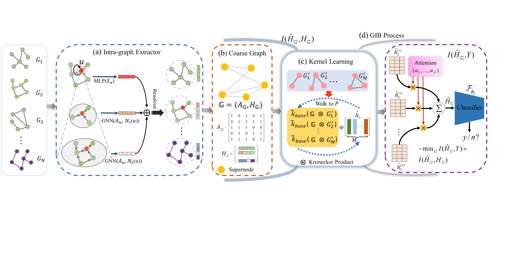

# Where to Find Fascinating Inter-Graph Supervision: Imbalanced Graph Classification with Kernel Information Bottleneck




This code requires the following:
* python=3.8

* pyTorch=1.1.2+cu111

* torch-cluster=1.6.0

* numpy=1.23.4

* scipy=1.10.1

* scikit-learn=0.0.post1

* torch-geometric=2.2.0

* torch-scatter=2.0.9

* torch-sparse=0.6.13

* cuda=11.1

   

This step is to run the below code to perform our model:
```
python run.sh
```
